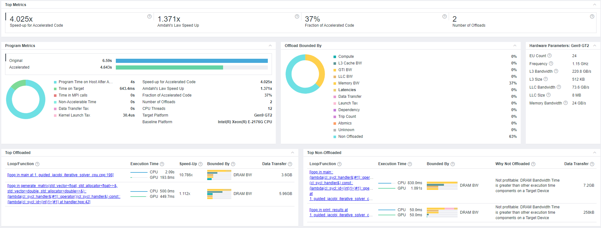
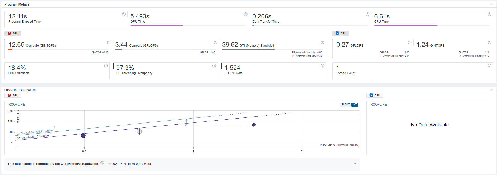

# `Jacobi Iterative Solver` Sample

The `Jacobi Iterative Solver` Sample shows how to use the Intel Base Toolkit to use CPU, GPU and multi Gpu offload using SYCL and the differences in sample runtime using different targes.  

For comprehensive instructions see the [DPC++ Programming](https://software.intel.com/en-us/oneapi-programming-guide) and search based on relevant terms noted in the comments.

| Property                          | Description
|:---                               |:---
| What you will learn               | How to different targets impact the behaviour of the sample, how does the oneAPI random number generators work. 
| Time to complete                  | 10 minutes


## Purpose

This sample starts with a CPU oriented application and shows how to use SYCL and the oneAPI tools to offload regions of the code to the target system's GPU.  We'll use Intel Advisor to conduct offload modeling to identify code regions that will benefit the most from GPU offload. Once the initial offload is complete, we'll walk through how to develop an optimization strategy by iteratively optimizing the code baed on opportunities exposed Intel Advisor to run roofline analysis. 

The `Jacobi Iterative Solver` Sample refers to a system of equations represented by two input matrices with the first one being the number of unknown variables ant the second one being results. It calculates the results using the Jacobi Iterative method and compares the newly calculated results with the old ones.

The sample includes three different versions of the jacobi iterative solver project.
- `1_guided_jacobi_iterative_solver_cpu.cpp`: basic serial CPU implementation.
- `2_guided_jacobi_iterative_solver_gpu`: initial GPU offload version using SYCL.
- `3_guided_jacobi_iterative_solver_multi_gpu.cpp`: Multi GPU version. Currently unavailable.


## Prerequisites

| Optimized for                     | Description
|:---                               |:---
| OS                                | Linux* Ubuntu* 18.04; Windows 10
| Hardware                          | Skylake with GEN9 or newer
| Software                          | Intel® oneAPI DPC++/C++ Compiler


## Key Implementation Details

The basic DPC++ implementation explained in the code includes the use of the following :
* DPC++ local buffers and accessors (declare local memory buffers and accessors to be accessed and managed by each DPC++ workgroup)
* Code for Shared Local Memory (SLM) optimizations
* DPC++ kernels (including parallel_for function and range<1> objects)

## Building the `Jacobi Iterative Solver` Program for CPU and GPU


> **Note**: If you have not already done so, set up your CLI
> environment by sourcing  the `setvars` script located in
> the root of your oneAPI installation.
>
> Linux Sudo: . /opt/intel/oneapi/setvars.sh
>
> Linux User: . ~/intel/oneapi/setvars.sh
>
>For more information on environment variables, see Use the setvars Script for [Linux or macOS](https://www.intel.com/content/www/us/en/develop/documentation/oneapi-programming-guide/top/oneapi-development-environment-setup/use-the-setvars-script-with-linux-or-macos.html.

> **Note**: For GPU Analysis on Linux* enable collecting GPU hardware metrics by setting the value of dev.i915 perf_stream_paranoidsysctl option to 0 as follows. This command makes a temporary change that is lost after reboot:
>
> `sudo sysctl -w dev.i915.perf_stream_paranoid=0`
>
>To make a permanent change, enter:
>
> `sudo echo dev.i915.perf_stream_paranoid=0 > /etc/sysctl.d/60-mdapi.conf`

### Running Samples in Intel&reg; DevCloud

If running a sample in the Intel&reg; DevCloud, you must specify the compute node (CPU, GPU, FPGA) and whether to run in batch or interactive mode. For more information, see the Intel&reg; oneAPI Base Toolkit [Get Started Guide](https://devcloud.intel.com/oneapi/get_started/).

### Using Visual Studio Code*  (Optional)

You can use Visual Studio Code (VS Code) extensions to set your environment, create launch configurations,
and browse and download samples.

The basic steps to build and run a sample using VS Code include:
 - Download a sample using the extension **Code Sample Browser for Intel&reg; oneAPI Toolkits**.
 - Configure the oneAPI environment with the extension **Environment Configurator for Intel oneAPI Toolkits**.
 - Open a Terminal in VS Code (**Terminal>New Terminal**).
 - Run the sample in the VS Code terminal using the instructions below.

To learn more about the extensions and how to configure the oneAPI environment, see
[Using Visual Studio Code with Intel&reg; oneAPI Toolkits User Guide](https://software.intel.com/content/www/us/en/develop/documentation/using-vs-code-with-intel-oneapi/top.html).

### On a Linux* System
Perform the following steps:
1. Build the program using the following `cmake` commands.
```
$ mkdir build
$ cd build
$ cmake ..
```

2. Run the program :
```
$ make run_1_cpu 
```
> Note: the following run commands area also available and correspond to the specific build targets. 

    make run_2_gpu
    make run_3_gpu_optimized
    make clean

> Note: the command below will be available when multi GPU enviroment can bu run on devcloud

    make run_4_multi_gpu

## Guided Builds

Below is the step by step guide that shows how to optimize the Jacobi Iterative method. We'll start with code that runs on the CPU, then a basic implementation of GPU offload, then run a GPU optimiezd version of the code. We will use the Intel&reg; Advisor analysis tool to provide performance analysis of the built applications. 

> **Note**: The actual results and measurements may vary depending on your actual hardware.

### Offloading modeling

The first step is to run offload modeling on the CPU only version to identify the parts of code that can be accelerated.

To run the Advisor with the cpu, the following command has to be used:

`advisor --collect=offload --config=gen9_gt2 --project-dir=./../advisor/1_cpu -- ./src/1_guided_jacobi_iterative_solver_cpu`

> **Note**: If you are connecting to a remote system where the oneAPI tools are installed, you may not be able to launch the Intel&reg; Advisor gui.  You can transfer the html report to a local machine for viewing.

View the results:\
`advisor-gui ../advisor/1_cpu/e000/e000.advixeexp`

Based on the output captured from Advisor we can see a predicted acceleration if we use GPU offload.



### GPU basic offloaded version

The  2_guided_jacobi_iterative_solver_gpu uses the basic offload of each for loop into a GPU. For example the main loop calculating the unknown variables will be calculated by N kernels where N is the number of rows in the matrix. Even this basic offload improves the execution time considierably.

Once the offload code is written, we'll want to run the roofline analysis to look for areas where there is room for performance optimization.

`advisor --collect=roofline --profile-gpu --project-dir=./../advisor/2_gpu -- ./src/2_guided_jacobi_iterative_solver_gpu`

To view the results: 
`advisor-gui ../advisor/2_gpu/e000/e000.advixeexp`



### Multi GPU version

Currently unavailable.

## Output
```
[ 12%] Building CXX object src/CMakeFiles/4_guided_jacobi_iterative_solver_MultiGPU.dir/4_guided_jacobi_iterative_solver_MultiGPU.cpp.o
[ 25%] Linking CXX executable 4_guided_jacobi_iterative_solver_MultiGPU
[ 25%] Built target 4_guided_jacobi_iterative_solver_MultiGPU
[ 37%] Building CXX object src/CMakeFiles/2_guided_jacobi_iterative_solver_gpu.dir/2_guided_jacobi_iterative_solver_gpu.cpp.o
[ 50%] Linking CXX executable 2_guided_jacobi_iterative_solver_gpu
[ 50%] Built target 2_guided_jacobi_iterative_solver_gpu
[ 62%] Building CXX object src/CMakeFiles/3_guided_jacobi_iterative_solver_GPUOptimization.dir/3_guided_jacobi_iterative_solver_GPUOptimization.cpp.o
[ 75%] Linking CXX executable 3_guided_jacobi_iterative_solver_GPUOptimization
[ 75%] Built target 3_guided_jacobi_iterative_solver_GPUOptimization
[ 87%] Building CXX object src/CMakeFiles/1_guided_jacobi_iterative_solver_cpu.dir/1_guided_jacobi_iterative_solver_cpu.cpp.o
[100%] Linking CXX executable 1_guided_jacobi_iterative_solver_cpu
[100%] Built target 1_guided_jacobi_iterative_solver_cpu

Scanning dependencies of target run_cpu
./jacobi_cpu_iterative_solver
Device : Intel(R) Core(TM) i7-10610U CPU @ 1.80GHz

Matrix generated, time elapsed: 0.31112 seconds.
[5122.01 263.22 1.67 626.22 317 -333.22 947.8 -852.83 -808.99 ][277.63]
[277.63 -4634.73 529.95 -657.22 -564.18 601.12 676.36 452.62 314.03 ][740.29]
[740.29 499.7 -4774.05 794.3 -156.33 -237.9 397.63 -160.86 916.96 ][76.47]
[76.47 -693.42 -135.63 4075.95 -287.56 993 936.34 -28.63 86.55 ][833.52]
[833.52 769.69 -400.31 443.35 -5587.83 431.49 453.66 556.13 845.82 ][844.33]
[844.33 549.12 440.36 416.48 -236.84 -4121.63 -460.53 -236.51 -359.54 ][-358.82]
[-358.82 -655.35 -569.26 -982.24 102.27 522.64 -4836.28 -534.2 -552.49 ][545.54]
[545.54 -403.51 249.11 918.1 -575.88 -151.27 159.93 3964.62 -770 ][-216.26]
[-216.26 751.31 267.88 691.34 -161.82 973.27 908.53 -175.76 -4150.42 ][-813.02]

Computations complete, time elapsed: 0.295054 seconds.
Total number of sweeps: 30
Checking results
All values are correct.

Check complete, time elapsed: 0.00481672 seconds.
Total runtime is 0.750036 seconds.
X1 equals: 0.09895873327
X2 equals: -0.15802401129
X3 equals: 0.03854686450
X4 equals: 0.16617806412
X5 equals: -0.12925305745
X6 equals: 0.11829640135
X7 equals: -0.13914309700
X8 equals: -0.09521910620
X9 equals: 0.19864875400
Built target run_cpu
```

## License

Code samples are licensed under the MIT license. See
[License.txt](https://github.com/oneapi-src/oneAPI-samples/blob/master/License.txt) for details.

Third party program Licenses can be found here: [third-party-programs.txt](https://github.com/oneapi-src/oneAPI-samples/blob/master/third-party-programs.txt)


